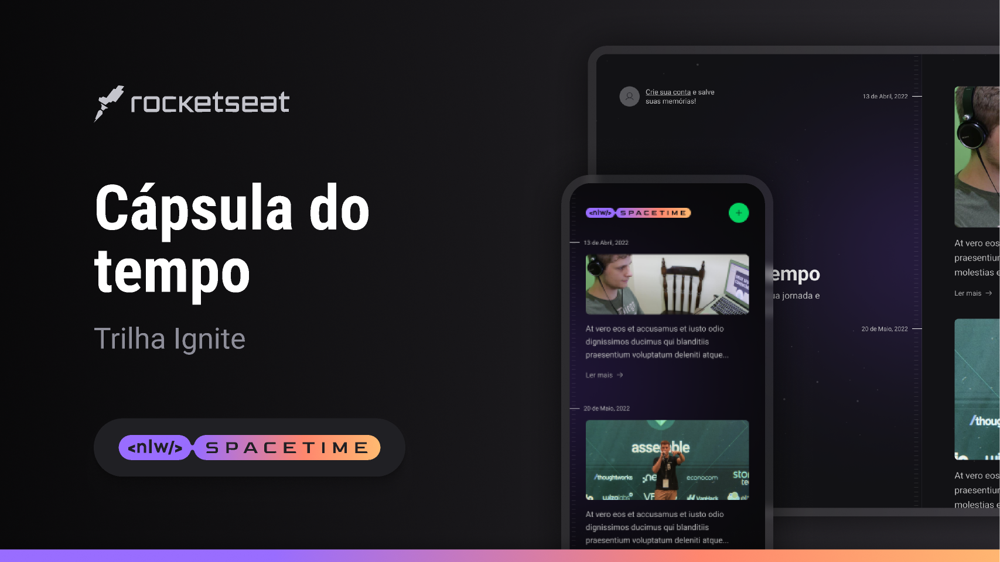

<h1 align="center">NLW 12 - Spacetime</h1>

<p align="center">
  <h3 align="left">Front-end Web</h3>
  <p>
    <a alt="ReactJS">
      
    </a>
    <a alt="NextJS">
      
    </a>
    <a alt="TypeScript">
      
    </a>
    <a alt="TailwindCSS">
      
    </a>
    <a alt="Axios">
      
    </a>
    <a alt="Figma">
       
    </a>
  </p>
  
  <h3 align="left">Front-end Mobile</h3>
  <p>
    <a alt="React Native">
      
    </a>
    <a alt="Expo">
      
    </a>
    <a alt="TypeScript">
      
    </a>
    <a alt="TailwindCSS">
      
    </a>
    <a alt="Axios">
      
    </a>
    <a alt="Figma">
       
    </a>
  </p>
  
  <h3 align="left">Back-end</h3>
  <p>
    <a alt="NodeJS">
      
    </a>
    <a alt="Fastify">
      
    </a>
    <a alt="TypeScript">
      
    </a>
    <a alt="Prisma">
      
    </a>
    <a alt="Zod">
      
    </a>
    <a alt="Axios">
      
    </a>
    <a alt="SQLite">
      
    </a>
  </p>
</p>

<br>

<div align="center">
  
</div>

<h4 align="center">
  
  [Ver projeto](https://rocketseat-nlw12-frontend.vercel.app/)
</h4>

<br>

<p align="center">
  <a href="#projeto">Projeto</a> •
  <a href="#projeto">Executando</a> •
  <a href="#layout">Layout</a>
</p>

## 💻 Projeto<a id="projeto"></a>

Projeto de uma cápsula do tempo, ou seja, um lugar para guardar memórias. Desenvolvido durante o evento NLW 12 - Spacetime, da Rocketseat, ele conta com funcionalidades como Login com o Github e cadastro de memória com texto e foto.

Caso queira ver o projeto web, clique [aqui](https://rocketseat-nlw12-frontend.vercel.app/).

## 🔧 Executando localmente

Após clonar o repositório, é preciso primeiro iniciar o servidor Node, para isso acesse a pasta backend e:

#### Instale as dependências
```bash
npm install
```

#### Insira as variáveis de ambiente
```bash
#.env

DATABASE_URL={link para um banco de dados mysql}

# Crie um OAuth app no Github com as seguintes informações:
# Homepage URL: http://localhost:3000/
# Authorization callback URL para Web: http://localhost:3000/api/auth/callback
# Authorization callback URL para Mobile: rode "npm run start" na pasta mobile e veja o link no qual está rodando a aplicação (ex: exp://123.456.7.89: 1234)
GITHUB_CLIENT_ID={Client ID do seu OAuth app}
GITHUB_CLIENT_SECRET={Client Secret do seu OAuth app}
```

#### Inicie o servidor de desenvolvimento
```bash
npm run dev
```

### Web
Acesse a pasta "frontend" e:

#### Instale as dependências
```bash
npm install
```

#### Insira as variáveis de ambiente
```bash
#.env

NEXT_PUBLIC_GITHUB_CLIENT_ID={Client ID do seu OAuth app para Web}
NEXT_PUBLIC_IMGBB_API_KEY={Sua API key do site ImgBB}
```

#### Inicie o servidor de desenvolvimento
```bash
npm run dev
```

Acesse [http://localhost:3000](http://localhost:3000) para visualizar a aplicação.

### Mobile
Acesse a pasta "mobile" e:

#### Instale as dependências
```bash
npm install
```

#### Insira as variáveis de ambiente
```bash
# src / app / index.tsx - linha 21

clientId: {Client ID do seu OAuth app para Mobile}
```

#### Inicie o servidor de desenvolvimento
```bash
npm run start
```

Utilize um emulador ou seu celular para visualizar a aplicação.

## 🔖 Layout<a id="layout"></a>

Você pode visualizar o layout do projeto clicando [aqui](https://www.figma.com/design/vEwNw2cxlr3bV6SdNL7Uif/C%C3%A1psula-do-tempo-%E2%80%A2-Trilha-Ignite-(Community)?node-id=205-3&t=MQvg3Uld5qLu25n0-0).
